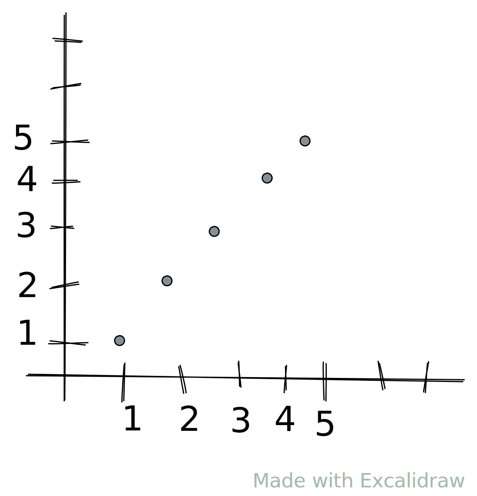
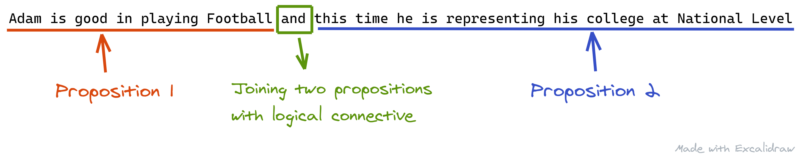
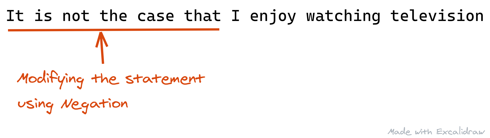

# Discrete Mathematics

## Why study Discrete Mathematics

- Develops Mathematical thinking
- improves problem solving abilities
- Important for subjects like Automata Theory, Compiler Design, etc.

## What is Discrete Mathematics?

- **Discrete Mathematics is the study of discrete objects.**
  > Discrete means: "Distinct or not connected"
- It is not a branch of mathematics. It is rather a description of set of branches that have one common property - that they are `discrete` not `continuous`.

### Discrete vs Continuous

The whole world of mathematics is divided into two realms:

1. Discrete
2. Continuous

|                                                  Discrete Objects                                                   |                                       Continuous Objects                                       |
| :-----------------------------------------------------------------------------------------------------------------: | :--------------------------------------------------------------------------------------------: |
|                                            Natural Numbers are Discrete.                                            |                                  Real Numbers are continuous                                   |
|                                               For Example: 1,2,3,4...                                               |                       For Example: between 0 an 1 - 0.1, 0.01,0.001,....                       |
|                                       `y = x` &forall; x &isin; N, y &isin; N                                       |                            `y = x` &forall; x &isin; R, y &isin; R                             |
|                                                                       |                                              |
| Digital Clock is _Discrete_ in nature, there is no continuous time and transition from one time to another is sharp | Analog clock is _continuous_ in nature, hour, minute and second hands move smoothly over time. |

## Propositional Logic

The Phrase Propositional Logic is composed of two words

| Proposition | Logic |
| :---------: | :---: |


### What is Logic?

- > Logic is Science of Reasoning.
  - It helps us to understand and reason about different mathematical statements.
- With rules of logic, we would be able to think about mathematical statements and finally we would be able to prove or disprove those mathematical statements precisely.
- **For Example:**
  - Rules of logic enable us to reason about the mathematical statement like:
  - _"For every positive Integer n, the sum of positive integers not exceeding n is `n(n+1)/2`"._
  - Either it is a valid mathematical arguement or it is invalid.

#### Purpose of logic

Its purpose is to construct valid arguments(or Proofs).
Once we prove that a mathematical statement is true then we call it a Theorem.

**Example**
_Famous Knights and Knaves Puzzle_
In an Island there are two kinds of inhabitants, _Knights_, who always tell the truth, and their opposites , _Knaves_, who always lie. You encounter two people Alice and Bob. Who are Alice and Bob if Alice says "Bob is a Knight" and Bob says "The two of us are opposite types"?.

> These types of problems can be very easily solved using an area of logic called propositional logic.

### What is Proposition?

> Proposition is a _declarative statement_ (a sentence that is declaring a fact or stating an argument) which can be either `TRUE` or `FALSE` but can't be both.

For Example:

- Delhi is Capital of India.
- Water froze this morning.
- 1 + 1 = 2 (base10)

Sentences which are not propositions:

- What time is it?
- `x + 1 = 2` (what is x is 10)
- Send us your Resume before 11PM
- I request you to please allow me a day off.
- Fetch my Umbrella.

### What is Propositional Logic?

_Area of logic that studies ways of joining and/or modifying propositions to form more complicated propositions and it also studies the logical relationships and properties derived from these combined/altered propositions._

> **Example 1:**
>
> Statement 1: - "Adam is good in playing Football"
>
> Statement 2: - "Adam is good in playing Football and this time he is representing his college at National Level."
> 

> **Example 2:**
>
> Statement 1: "I enjoy watching television."
>
> Statement 2: "It is not the case that I enjoy watching television"
> 

> Propositional Logic is sometimes called as **_"Sentential Logic"_** or **_"Statement Logic"_**.

#### Why we need Compound Propositions?

It is because most of the mathematical statements are construced by combining one or more than one propositions.

#### Propositional Variables

Variables that are used to represent propositions are called propositional Variables.

> **Example:**
> 
> _"Adam is good in playing Football and this time he is representing his college at National Level"_
> 
> This statement can be represented as:
> 
```
p =  Adam is good in playing Football
q = this time he is representing his college at National Level
```
> 
> `p ^ q` or `p and q`

##### Logical Operators

There are 6 logical operators:

1. Negation
2. Conjunction
3. Disjunction
4. Exclusive OR
5. Implication
6. Biconditional

**Negation**

Let `p` be a proposition. &not;`p` is called negation of p which simply states that _"It is not that case that `p`"_

- If `p` is true then &not;`p` is false.
- If `p` is false then &not;`p` is true.

> **For Example:**
>
> If `p` = "Adam and Eve lived together for many years.", then,
>
> &not;`p` = "It is not the case that Adam and Eve lived together for many years."

**Truth Table for Negation**
|  `p`  | &not;`p` |
| :---: | :------: |
|   T   |    F     |
|   F   |    T     |
