# Theory of Computation

- It is about what kind of things we can really compute mechanically, how fast and how much space does it take to do so.
- What a machine does?
    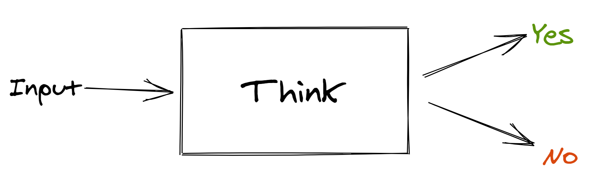
- Levels in this Subject
    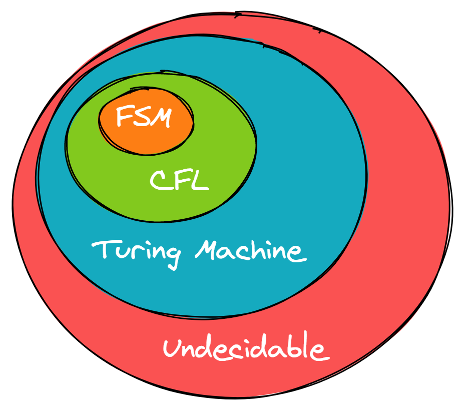
    - `FSM` : Finite State Machine
    - `CFL` : Context Free Language

## Finite State Machine

- **Symbol**
>  - Example: a,b,c,1,2,3...
- **Alphabet**
  - &Sigma; - Collection of Symbols 
>  - Example: {a,b}, {d,e,f,g}, {0,1,2}
- **String**
  - Sequence of Symbols
>  - Example: a,b,1,2,aa,bb,ab,ba
- **Language**
  - Set of strings
  - > Example: &Sigma; = {0,1}
  - > L1 = Set of all strings of length 2 = {00,11,01,10}
  - > L2 = Set of all strings of length 3 = {000, 001, 010, 011, 100, 101, 110, 111}
  - > L3 = Set of all strings that begin with 0 = {0,00,01,000,001,010,0000,......}

| Finite | Infinite |
|:--:|:--:|
| L1 and L2 | L3 |

### Powers of &Sigma;

Let Alphabet set be &Sigma; = {0,1}

&Sigma;0 = Set of all strings of length 0
- &Sigma;0 = { &straightepsilon; }

&Sigma;1 = Set of all strings of length 1
- &Sigma;1 = { 0,1 }

&Sigma;2 = Set of all strings of length 2
- &Sigma;2 = { 00,01,10,11 }

&Sigma;3 = Set of all strings of length 3
- &Sigma;3 = { 000, 001, 010, 011, 100, 101, 110, 111 }

&Sigma;n = Set of all strings of length n

### Cardinality

Numbers of Element in a set

For 2 alphabets, cardinality is 2n

&Sigma;\* = &Sigma;0 &cup; &Sigma;1 &cup; &Sigma;2 &cup; .....

&Sigma;\* = { &straightepsilon; } &cup; {0,1} &cup; { 00,01,10,11 } &cup; ........
> Set of all possible strings of all lengths over {0,1} which is infinite &infin;

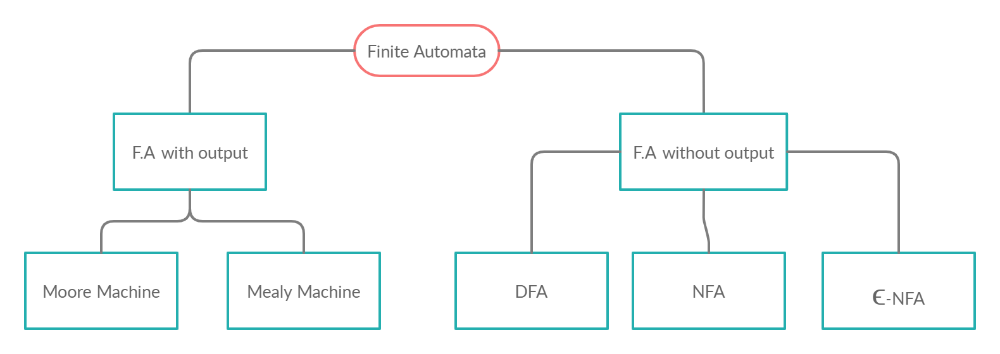

- It is Simplest mode of communication
- It has very limited memory

**DFA** - Deterministic Finite Automata

Every DFA can be defined using 5 tuples: ( Q, &Sigma;, q0, F, &delta;)
- Q = Set of all states
- &Sigma; = Inputs
- q0 = Start State/Initial State
- F = Set of Final states
- &delta; = Transition function that maps Q &times; &Sigma; &rarr; Q

> Example of DFA:
> 
> 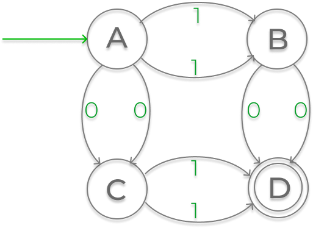
> 
> - The letters A,B,C,D inside circles are states
> - The arrows or edges are transitions from one state to another
> - `A` is the initial state so the extra start arrow
> - `D` is the final state so the double circle
> ---
> - Q = {A, B, C, D}
> - &Sigma; = {0,1}
> - q0 = A
> - F = {D}
> 
||**0**|**1**|
|:--:|:--:|:--:|
|**A**|C|B|
|**B**|D|A|
|**C**|A|D|
|**D**|B|C|

**Example 1 of DFA**
L1 = List of all strings that start with`0` = {0,00,01,001,010,011,000,...}

This is a infinite set.

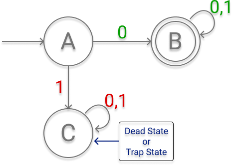

|||
|:--:|:--:|
|Q|{A,B,C}|
|&Sigma;|{0,1}|
|q0|A|
|F|{B}|
Let's Verify
1. `001` ✔

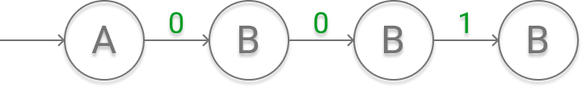

This String gets accepted because it reaches final state of the DFA which is B.

---
2. `101` ❌

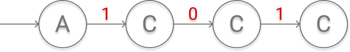

This String does not get accepted because it does not reach final state.

**Example 2 of DFA**

Construct a DFA that accepts sets of all strings over {0,1} of length 2.
- &Sigma; = {0,1}
- L = {00,01,10,11}
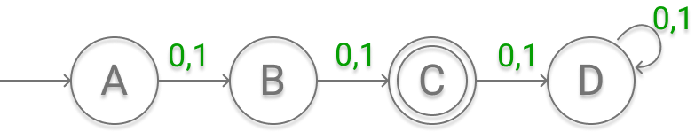

|||
|:--:|:--:|
|Q|{A,B,C,D}|
|&Sigma;|{0,1}|
|q0|A|
|F|{c}|
Let's Verify
1. `00` ✔

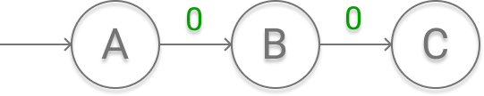

This String gets accepted because it reaches final state of the DFA which is C.

---
2. `10` ✔

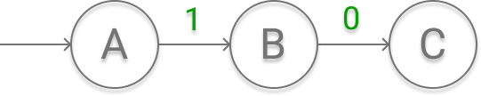

This String gets accepted because it reaches final state of the DFA which is C.

---
3. `001` ❌

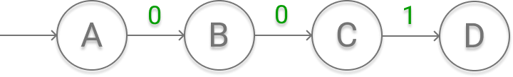

This String does not get accepted because it does not reach final state.

---
4. `1` ❌

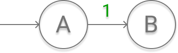
 
This String does not get accepted because it does not reach final state.

**Example 3 of DFA**
Construct a DFA that accepts any strings over {a,b} that does not contain the string `aabb` in it
 
&Sigma; = {a,b}

Let's Simplify our problem by designing a DFA which accepts all strings that contains `aabb` in it.
 
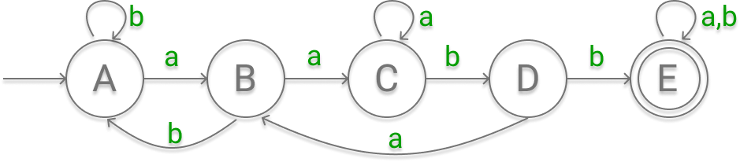

> **Flip the states**
> - Make the final states into non final states
> - Make the non-final states into final states

After flipping the states we get our required DFA.

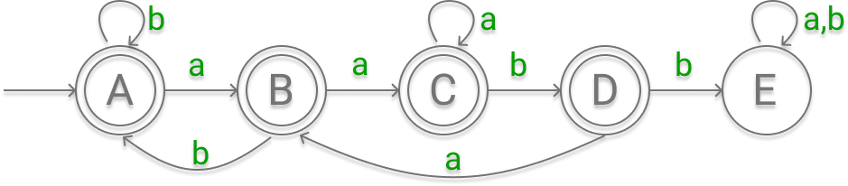

**Example 4 of DFA**

Figure out what the following DFA does:

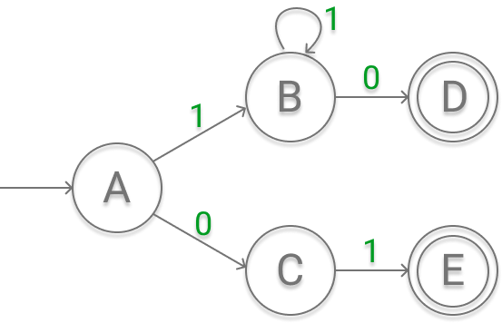

Accepted Strings:
- 10
- 111...10
- 01

L = {Accepts the string `01` or a string of atleast `1` followed by a `0`}

After reaching at a state if there isn't any place to go, then that string goes to a dead state.

So, complete DFA is follows:

### Regular Language

A language is said to be a Regular Language if and only if some Finite state Machine recognizes it.

A Non-regular language is
- not recognised by any FSM
- which require memory
  - Memory of FSM is limited
  - It can't store or count strings

Example of Non-regular Language:
- `ababbababb` : repeating string `ababb`
- an bn : aaabbb or aaaabbbb

#### Operations on Regular Languages

1. Union
   - A &Union; B = { x | x &isin; A or x &isin; B }

2. Concatenation
   - A &#x2218; B = {xy | x &isin; A and y &isin; B }

3. Star
   - A\* = {x1,x2,x3.........xn | k &ge; 0 and each xi &isin; A }

**Example on Regular Language Operations:**

A = {pq, r}

B = {t, uv}

A &cup; B = {pq, r, t, uv}

A &#x2218; B = {pqt, pquv, rt, ruv}

A\* = { &straightepsilon;, pq, r, pqr, rpq, pqpq, rr, pqpqpq, rrr, ....... }

> **Theorem 1:** The class of Regular Languages is closed under Union.

> **Theorem 2:** The class of Regular Languages is closed under Concatenation.

> The union of two regular language is a regular language and concatenation of two regular language is a regular language.